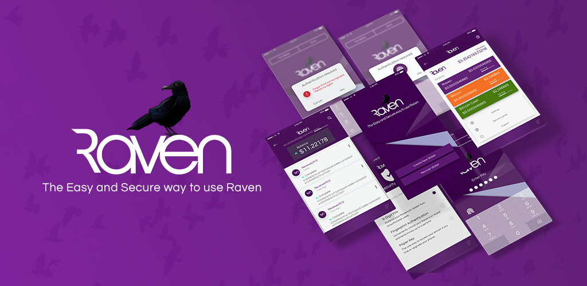

 
RVN Wallet for Android
----------------------------------

### A completely standalone Ravencoin wallet

Unlike many other wallets, This wallet is a real standalone Ravencoin client. There is no server to get hacked or go down, so you can always access your money. Using [SPV](https://en.bitcoin.it/wiki/Thin_Client_Security#Header-Only_Clients) mode, This wallet connects directly to the Ravencoin network with the fast performance you need on a mobile device.

### The next step in wallet security

This wallet is designed to protect you from malware, browser security holes. With AES hardware encryption, app sandboxing, and verified boot, it represents a significant security advance over web and desktop wallets.

### beautiful simplicity

Simplicity is the RVN wallet core design principle. A simple list of 12 words is all you need to restore your wallet on another device if yours is ever lost or broken.  Because it is [deterministic](https://github.com/bitcoin/bips/blob/master/bip-0032.mediawiki), your balance and transaction history can be recovered from just your backup words. These words are now compatible with the Ravencoin core wallet available [here](https://github.com/RavenProject/Ravencoin/releases/latest).

## features

- ["simplified payment verification"](https://github.com/bitcoin/bips/blob/master/bip-0037.mediawiki) for fast mobile performance
- no server to get hacked or go down
- 12 word backup that works forever
- private keys never leave your device
- import [password protected](https://github.com/bitcoin/bips/blob/master/bip-0038.mediawiki) paper wallets
- ["payment protocol"](https://github.com/bitcoin/bips/blob/master/bip-0070.mediawiki) payee identity certification

## How to set up the android development environment
### These instructions have been verified on Windows, Mac, or Ubuntu.

1. Download and install [Java 7](https://www.java.com/en/download/) or up.
2. Download and install Git/Github-CLI for GitHub [here](https://github.com/cli/cli) and [here](https://git-scm.com/download).
3. Open a Terminal, Bash, Command Prompt, or Power Shell and clone the repository using the command `git clone https://github.com/RavenProject/ravenwallet-android.git`. This will download the source code for the Android wallet.
4. Alternatively you can also go to the [github](https://github.com/RavenProject/ravenwallet-android) repository and clone or download the project manually.
5. Change directories into the newly created source code directory `cd .\ravenwallet-android\`.
6. Initialize the sub-modules using the command `git submodule init`.
7. Update the sub-modules using the command `git submodule update`.
8. A google-services.json fill will be needed to be created in order to compile and run the wallet app. This file is specific to you as a developer, as such you will need to create one (a Google account is required).
9. Open any Internet browser and navigate to [Google Firebase](https://console.firebase.google.com/) and log-in if prompted.
10. Click on the *Create a Project* or *Add Project* link. For the project name enter something like `my-ravencoin-wallet`, click *I accept the Firebase terms*, click the *Continue* button.
11. Leave the *Enable Google Analytics for this project* enabled and click Continue. Select your location and accept the terms, then click *Create Project*. This will take a few minutes and will create a project, click *Continue* when it is done. This will open a project overview window.
12. Click the *Settings* button next to *Project Overview* and select *Project Settings*. Click on the Android icon next to the *There are no apps in your project*.
13. Create an Android package name (com.*yourname*.ravencoin.wallet). Optionally you can also enter a Debug signing certificate, follow the instructions by clicking the *?* above the text-box. Then cick the *Register app* button.
14. Click the the *Download google-services.json* button to download the JSON file.
15. You can manually copy this file to the root directory of the repository downloaded in step 5, or follow the instructions listed on the Firebase Console webpage to add the file using Android Studio.
16. Download and Install the latest [Android studio](https://developer.android.com/studio) (Use the default options in installer and open Android Studio).
17. When Android Studio first opens choose the *standard install* configuration option and then *light* or *dark* theme as desired. At this point you shoud see a *Welcome to Android Studio* window.
18. In the *Welcome to Android Studio* window, select the *Open the project with Android Studio* and navigate to the directory where the github repository was downloaded (step 5) and select it above and click *OK* (by default should be named ravenwallet-android).
19. The project will take a few mintues to synchronize. Once synchronized you should see two build warnings in the *build* window (if not visible, click the *build* tab at the lower-left of the main Android Studio window). These failrues are because the NDK and SDK licenses haven't been accepeted yet. Click on the second error *Failed to install the following Android SDK packages as some licences have not been accepted.* In the right-half of the *build* window click on the *Install latest NDK and sync project* link.
20. In the *SDK Quickfix Installation* pop-up window, read throught the license agreement and click on the *Accept* radio button and click *Next*. This will download and install the SDK/NDK, click *Finish* once the installation is done.
21. Android Studio will now download all the required tool and build the project. This will take several minutes.
22. If any information dialogs are visible in the lower-right corner, click on the link and follow the instructions. You may have more than one. For example you may see a dialog indicating *Plugin Update Recommended - Android Gradle Plugin is ready to update* or *Restart to activate plugin updates*. Click on the underlined actions for each of these and follow the prompts.
23. Select the build variant by clicking on the *Build Variants* tab near the bottom of the left-side (available options are rvnDebug, rvnRelease, rvnTestnetDebug, and rvnTestnetRelease). For general testing and development the best option is to choose the *rvnTestnetDebug* in the *Build Variants / Active Build Variant* window. Also select the *x86_64* in the *Build Variants / Active ABI* window. 
24. In the *Android Studio / Build* window the build should now show *ravenwallet-android: successful*, there may be warnings, these can be ignored.
25. The following steps allow you to run and test the app in an *Android Virtual Device*.
26. In *Android Studio*, click on *Tools->AVD Manager* from the menu.
27. In the *AVD Manager* window click on *Create Virtual Device*.
28. In the *Phone* category choose a device to emulate, a good option is the *Pixel 3a* or *Pixel 3XL*. 
29. Once a phone has been selected click *Next*.
30. On the right side of the *Virtual Device Configuration* window, there may be a warning *HAXM is not installed*, if so click on the *Install HAXM* link, accept the default values and click *Next*, and finally *Finish* once the HAXM installation is done.
31. Back in the *Virtual Device Configuraion* window select an Android version (Q or R are good options), click on the *Download* link for the desired version. Read and accept the Tearms and Conditions and click *Next*. This will download and install the desired version. Click *Finish* once the installation is done. This can be repeated for as many system images as desired.
32. You should now have a virtual device listed in the *Android Virtual Device Manager*, this window can now be closed.
33. Finally it is time to run the RVN Wallet app in the virtual device you just created. Click *Run->Run* from the *Android Studio* window, or click the *play* (sideways-triangle) button. This should build the app, launch a virtual phone device, and install-run the RVN Wallet!
34. You can switch between Testnet and Mainnet versions using the *Build Variants / Active Build Variant* window. You should uninstall the installed version when switching.
35. Have fun and help support RavenCoin by contributing. An up-to-date list of desired features and enhancements can be found [here](https://github.com/RavenProject/Ravencoin/tree/master/community). Submit or work on any of the issues which can be found [here](https://github.com/RavenProject/ravenwallet-android/issues). The RVN community is stronger when you help!

## Android Basics
An basic tutorial for understanding how to use Android Studio can be found [here](https://developer.android.com/training/basics/firstapp)
